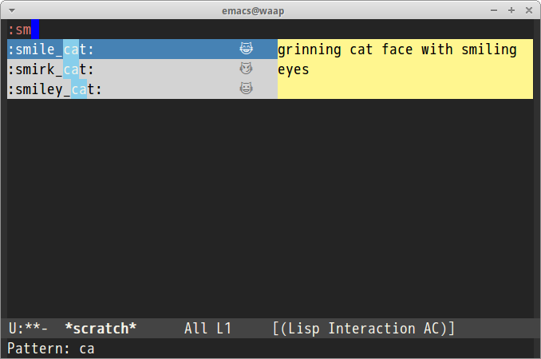

# ac-emoji [![melpa badge][melpa-badge]][melpa-link] [![melpa stable badge][melpa-stable-badge]][melpa-stable-link]

[auto-complete](https://github.com/auto-complete/auto-complete) source of [emoji](http://www.emoji-cheat-sheet.com/).


## Screencast


## Installation

`ac-emoji` is available on [MELPA](http://melpa.org/) and [MELPA stable](http://stable.melpa.org/)

You can install `ac-emoji` with the following command.

<kbd>M-x package-install [RET] ac-emoji [RET]</kbd>

## Command

#### `M-x ac-emoji-setup`

Set auto-complete emoji source to `ac-sources`


## Sample Configuration

```lisp
(add-hook 'markdown-mode-hook 'ac-emoji-setup)
(add-hook 'git-commit-mode-hook 'ac-emoji-setup)
```

### MacOSX Users

NOTE: This package does not work with Emacs 25.1 on MacOSX.


Please add following font configuration to your `init.el`.

```lisp
(set-fontset-font
 t 'symbol
 (font-spec :family "Apple Color Emoji") nil 'prepend)
```

### Linux Users

Linux users can use [Symbola](http://zhm.github.io/symbola/) font.
Ubuntu/Debian provides Symbola as package, `ttf-ancient-fonts` or `ttf-ancient-fonts-symbola`.

```lisp
(set-fontset-font
 t 'symbol
 (font-spec :family "Symbola") nil 'prepend)
```




### Windows Users

Windows 7 or higher installs emoji font as default. I suppose you need not to set font configuration(I confirmed only Windows7 and I don't understand Windows well).

[melpa-link]: https://melpa.org/#/ac-emoji
[melpa-stable-link]: https://stable.melpa.org/#/ac-emoji
[melpa-badge]: https://melpa.org/packages/ac-emoji-badge.svg
[melpa-stable-badge]: https://stable.melpa.org/packages/ac-emoji-badge.svg
